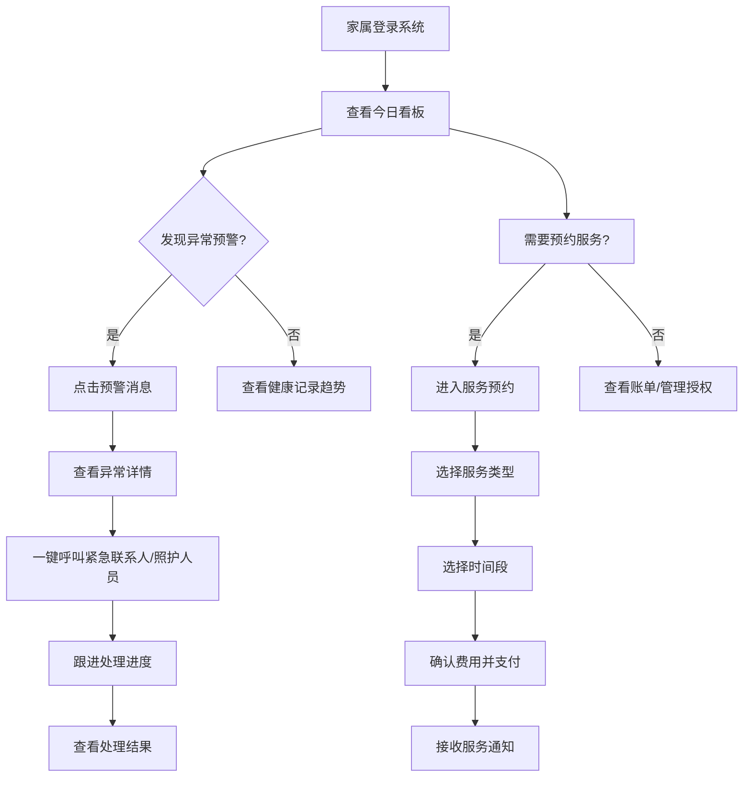

## 1. 产品概述

居家养老家属端 Web 应用，旨在让子女远程实时了解老人的照护情况，解决异地养老的信息不对称问题。
- 核心用户：居住在异地或同城但无法全天候照料的子女家属
- 核心价值：提供透明、安心、便捷的远程照护管理体验，让家属随时掌握老人健康状况、服务进度，实现高效沟通与资源调度

## 2. 核心功能

### 2.1 用户角色

| 角色 | 注册方式 | 核心权限 |
|------|----------|----------|
| 家属用户 | 手机号注册 + 实名认证 | 查看老人信息、预约服务、管理账单、授权资料、接收通知 |

### 2.2 功能模块

1. **今日看板**：老人定位签到、最近探访记录、用药提醒完成状态、健康指标趋势概览
2. **健康记录**：历史健康数据、体征趋势图表、异常记录、体检报告
3. **服务预约**：服务类型选择、时间段预约、费用确认、预约记录管理
4. **消息通知**：异常预警、服务完成通知、照片回传、评价入口
5. **账单明细**：充值记录、扣费记录、退款记录、账户余额
6. **资料授权**：紧急联系人管理、照护人员授权、查看范围设置

### 2.3 页面详情

| 页面名称 | 模块名称 | 功能描述 |
|----------|----------|----------|
| 今日看板 | 定位签到卡片 | 显示老人当前位置、签到时间、签到状态地图标记 |
| 今日看板 | 最近探访卡片 | 显示最近探访人员、时间、探访照片、探访记录链接 |
| 今日看板 | 用药提醒卡片 | 今日用药列表、完成状态、漏药提醒、下次用药时间 |
| 今日看板 | 健康趋势卡片 | 血压、血糖、心率、体温等关键指标迷你趋势图 |
| 今日看板 | 快捷操作区 | 一键呼叫、立即预约、发送消息等快捷入口 |
| 健康记录 | 指标筛选器 | 按时间范围、指标类型筛选健康数据 |
| 健康记录 | 趋势图表区 | 多维度折线图/柱状图展示健康指标变化 |
| 健康记录 | 异常记录列表 | 超出正常范围的指标高亮标注、处理状态 |
| 健康记录 | 体检报告列表 | 体检报告上传记录、在线预览入口 |
| 服务预约 | 服务分类选择 | 上门护理、康复训练、助浴助洁、陪诊代办等分类卡片 |
| 服务预约 | 时间段选择 | 日历式选择器、可选/已满时段标记、时长选择 |
| 服务预约 | 费用确认 | 服务单价、时长费用、优惠券、总计金额明细 |
| 服务预约 | 预约记录 | 待服务/进行中/已完成/已取消状态标签、操作入口 |
| 消息通知 | 分类标签栏 | 全部/异常预警/服务通知/系统消息分类切换 |
| 消息通知 | 通知列表 | 消息卡片、未读标记、时间排序、批量已读 |
| 消息通知 | 照片回传 | 服务现场照片画廊、放大查看、保存下载 |
| 消息通知 | 评价入口 | 服务完成后跳转评价、星级评分、文字评价 |
| 账单明细 | 账户概览 | 当前余额、累计充值、累计消费、快捷充值入口 |
| 账单明细 | 交易记录列表 | 充值/扣费/退款分类标签、流水列表、金额、状态 |
| 账单明细 | 交易详情 | 订单编号、交易时间、支付方式、服务明细弹窗 |
| 资料授权 | 紧急联系人 | 联系人列表、添加/编辑/删除、优先级设置 |
| 资料授权 | 照护人员管理 | 已授权人员列表、授权有效期、权限范围 |
| 资料授权 | 查看范围设置 | 健康数据/定位信息/服务记录/账单信息开关控制 |

## 3. 核心流程

### 3.1 服务预约流程
家属选择服务类型 → 选择服务时间段 → 确认费用明细 → 提交预约 → 支付（余额/在线支付）→ 接收预约成功通知 → 服务前提醒 → 服务中实时进度 → 服务完成通知 + 照片回传 → 家属评价

### 3.2 异常预警处理流程
系统检测到异常指标/定位异常/漏药 → 推送预警消息给家属 → 家属查看详情 → 一键呼叫照护人员/紧急联系人 → 处理结果反馈 → 预警关闭记录

## 4. 用户界面设计

### 4.1 设计风格
- **主色调**：温暖的珊瑚橙 (#FF6B6B) 作为主色，传达关怀与活力；搭配健康绿 (#4ECDC4) 表示正常状态
- **辅助色**：柔和的夕阳金 (#FFE66D) 用于提醒与强调；冷静蓝 (#5C7AEA) 用于数据与信息
- **背景色**：米白色渐变 (#FAFAFA → #F5F0EB)，营造温暖舒适的居家氛围
- **按钮风格**：圆角 16px，渐变填充，悬停时有柔和阴影与微缩放
- **字体**：标题使用 "Noto Serif SC" 衬线字体，传递专业与温度；正文使用 "PingFang SC" 无衬线字体，保证可读性
- **布局风格**：卡片式布局，柔和圆角 (20px)，轻投影，模块间充足留白
- **图标风格**：Lucide 线性图标，统一 2px 线宽，状态色填充变体

### 4.2 页面设计概览

| 页面名称 | 模块名称 | UI 元素 |
|----------|----------|----------|
| 今日看板 | 顶部问候区 | 渐变色背景 + 老人头像卡片 + 实时问候语 |
| 今日看板 | 状态统计条 | 4 个圆形状态指示器 (签到/用药/探访/健康) |
| 今日看板 | 主体卡片网格 | 不对称 2x2 网格 + 右下角快捷操作浮动按钮组 |
| 健康记录 | 时间选择器 | 分段控件 (近7天/近30天/自定义) |
| 健康记录 | 图表区域 | 带渐变填充的面积图 + 阈值参考线 + 悬浮数据点 |
| 服务预约 | 服务卡片 | 图标 + 渐变圆形背景 + 服务名称 + 价格区间 |
| 服务预约 | 时间选择器 | 月视图日历 + 时段卡片网格 (可用/已满/已选状态) |
| 消息通知 | 预警卡片 | 左侧色条标识 (红/黄/绿) + 脉冲动画未读标记 |
| 账单明细 | 交易流水 | 时间轴布局 + 收入/支出方向箭头图标 |
| 资料授权 | 权限开关 | 带动画的切换开关 + 权限说明文字 |

### 4.3 响应式设计
- **桌面端优先**：最小支持 1280px 宽度，主内容区最大宽度 1440px
- **侧边栏导航**：桌面端固定左侧 240px，平板端收起为汉堡菜单
- **卡片布局**：桌面端 2-3 列网格，平板端 2 列，移动端单列
- **触摸优化**：点击区域不小于 44x44px，关键按钮增大触摸热区
- **表格响应式**：小屏幕下转换为卡片式列表，关键列固定

### 4.4 动效与微交互
- **页面进入**：卡片从底部 20px 渐入上浮，按网格位置依次延迟 50ms
- **数据加载**：骨架屏脉冲动画 + 渐显过渡
- **状态切换**：Tab 切换时内容区横向滑动过渡
- **预警提醒**：新预警消息顶部滑入 + 轻微左右抖动
- **按钮交互**：悬停时上浮 2px + 阴影加深，点击时缩放 0.98
