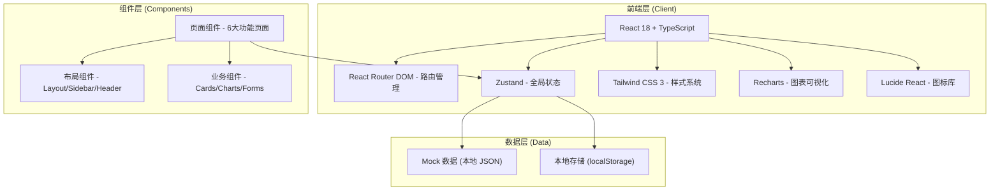
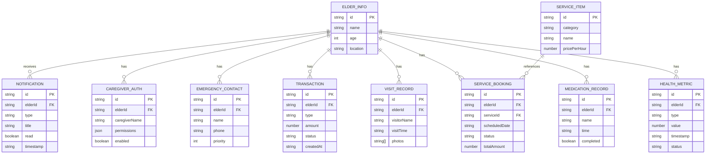

## 1. 架构设计



## 2. 技术说明

- **前端框架**：React 18 + TypeScript
- **初始化工具**：Vite (vite-init react-ts 模板)
- **后端方案**：无后端，使用本地 Mock 数据模拟
- **数据持久化**：localStorage 存储用户偏好和临时数据
- **路由管理**：React Router DOM v6
- **状态管理**：Zustand (轻量级状态管理)
- **样式方案**：Tailwind CSS 3.4 + CSS 变量主题系统
- **图表库**：Recharts (健康指标趋势图)
- **图标库**：Lucide React
- **日期处理**：原生 Date API (轻量场景足够)

## 3. 路由定义

| 路由路径 | 页面名称 | 页面组件 | 说明 |
|----------|----------|----------|------|
| `/` | 今日看板 | Dashboard | 默认首页，展示核心信息概览 |
| `/health` | 健康记录 | HealthRecords | 历史健康数据与趋势图表 |
| `/services` | 服务预约 | ServiceBooking | 服务选择、预约与记录 |
| `/notifications` | 消息通知 | Notifications | 预警、通知、照片与评价 |
| `/billing` | 账单明细 | Billing | 充值、扣费、退款记录 |
| `/authorization` | 资料授权 | Authorization | 联系人和权限管理 |

## 4. API 定义 (Mock 接口)

本项目为纯前端演示，所有 API 通过 Mock 数据层模拟，使用 Promise + setTimeout 模拟异步请求延迟。

### 4.1 类型定义

```typescript
// 老人基本信息
interface ElderInfo {
  id: string;
  name: string;
  avatar: string;
  age: number;
  location: string;
  lastCheckIn: {
    time: string;
    place: string;
    status: 'normal' | 'warning';
  };
}

// 健康指标
interface HealthMetric {
  id: string;
  type: 'blood_pressure' | 'blood_sugar' | 'heart_rate' | 'temperature';
  value: number;
  value2?: number; // 血压舒张压
  unit: string;
  timestamp: string;
  status: 'normal' | 'high' | 'low';
}

// 用药记录
interface MedicationRecord {
  id: string;
  name: string;
  dosage: string;
  time: string;
  completed: boolean;
  imageUrl?: string;
}

// 探访记录
interface VisitRecord {
  id: string;
  visitorName: string;
  visitorRole: string;
  visitorAvatar: string;
  visitTime: string;
  duration: string;
  notes: string;
  photos: string[];
}

// 服务项目
interface ServiceItem {
  id: string;
  category: 'nursing' | 'rehabilitation' | 'bathing' | 'companion' | 'other';
  name: string;
  description: string;
  pricePerHour: number;
  minHours: number;
  icon: string;
  available: boolean;
}

// 服务预约
interface ServiceBookingRecord {
  id: string;
  serviceId: string;
  serviceName: string;
  scheduledDate: string;
  scheduledTime: string;
  duration: number;
  totalAmount: number;
  status: 'pending' | 'confirmed' | 'in_progress' | 'completed' | 'cancelled';
  caregiverName?: string;
  createdAt: string;
}

// 通知消息
interface Notification {
  id: string;
  type: 'warning' | 'service' | 'system' | 'photo';
  title: string;
  content: string;
  timestamp: string;
  read: boolean;
  metadata?: Record<string, any>;
}

// 交易记录
interface Transaction {
  id: string;
  type: 'recharge' | 'deduct' | 'refund';
  amount: number;
  balanceAfter: number;
  description: string;
  orderNo?: string;
  paymentMethod?: string;
  status: 'success' | 'pending' | 'failed';
  createdAt: string;
}

// 紧急联系人
interface EmergencyContact {
  id: string;
  name: string;
  relationship: string;
  phone: string;
  priority: number;
  enabled: boolean;
}

// 照护人员授权
interface CaregiverAuthorization {
  id: string;
  caregiverName: string;
  caregiverPhone: string;
  permissions: {
    healthData: boolean;
    location: boolean;
    serviceRecords: boolean;
    billingInfo: boolean;
  };
  validFrom: string;
  validTo: string;
  enabled: boolean;
}
```

## 5. 数据模型

### 5.1 数据关系图



### 5.2 初始 Mock 数据

所有数据存储在 `src/data/mockData.ts` 中，包含：
- 1 位老人的完整信息
- 30 天的健康指标记录 (每天4次测量)
- 7 天的用药提醒记录
- 最近 10 条探访记录
- 8 种服务项目
- 最近 20 条预约记录
- 15 条通知消息 (含预警/服务/系统/照片)
- 最近 30 条交易记录 (充值/扣费/退款)
- 3 位紧急联系人
- 2 位已授权照护人员

## 6. 项目目录结构

```
src/
├── components/          # 公共组件
│   ├── layout/         # 布局组件
│   │   ├── Layout.tsx
│   │   ├── Sidebar.tsx
│   │   └── Header.tsx
│   ├── common/         # 通用 UI 组件
│   │   ├── Card.tsx
│   │   ├── StatCard.tsx
│   │   ├── StatusBadge.tsx
│   │   └── EmptyState.tsx
│   └── charts/         # 图表组件
│       └── HealthTrendChart.tsx
├── pages/              # 页面组件
│   ├── Dashboard.tsx
│   ├── HealthRecords.tsx
│   ├── ServiceBooking.tsx
│   ├── Notifications.tsx
│   ├── Billing.tsx
│   └── Authorization.tsx
├── store/              # Zustand 状态管理
│   └── useAppStore.ts
├── data/               # Mock 数据
│   └── mockData.ts
├── types/              # TypeScript 类型定义
│   └── index.ts
├── utils/              # 工具函数
│   ├── formatters.ts
│   └── helpers.ts
├── App.tsx             # 主应用入口
├── main.tsx            # React 挂载入口
└── index.css           # 全局样式与 Tailwind 配置
```
